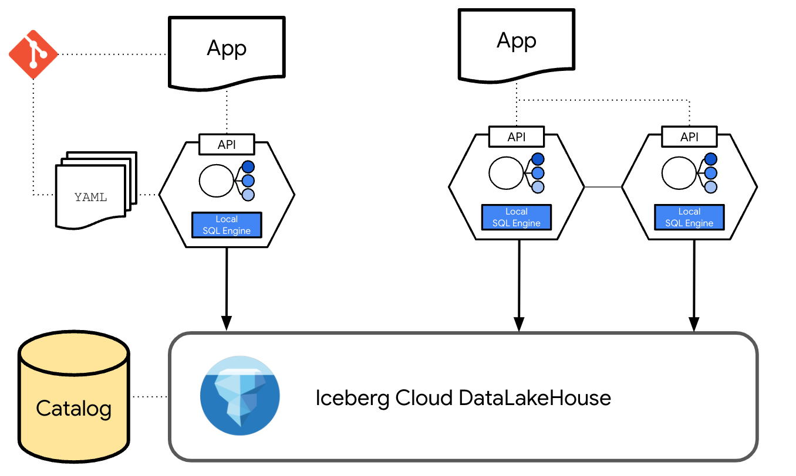

# dataPi



`datapi` (from data + API) is a Python package that allows you to implement a datalakehouse head , deploy data pods, list them, and generate documentation.

## Installation from source

Clone this repository and

```bash
pip install .
```

## How it works

- `dataPi` allow developers to specify in a simple YAML file what informational query their application needs
- When `datapi run` is executed it creates a dataPod, a container based deployable unit that contains a local engine to resolve the query.
- Each dataPod exposes an API REST, that when called, asks the metastore for the data location, and afer checking if permissions are in place, retrieves the data and executes locally to the container the query without calling the DataPlatform engine.
- Finally it sends the data back to the application.


## Getting Started

### DataLakeHouse platform requirements

`dataPi` builds on top of an existing Data Platform platform, currently there is support for:

- Lakehouse data format : [Apache Iceberg](https://iceberg.apache.org/)
- Cloud Storage: GCS, AWS S3 and Microsoft ADLS
- Metastore: [Apache Polaris](https://polaris.apache.org/)
- dataPod deployment target: [Google Cloud Run](https://cloud.google.com/run)
- dataPod build service: [Google Cloud Build](https://cloud.google.com/build)

Query sources supported: Iceberg tables

Query operators supported: `aggregate`, `group_by` and `filters`

### Initialize a New Project

To create a new `datapi` project, run:

```bash
datapi init [PROJECT_NAME]
```

If you don't specify a project name, it will default to 'datapi_project'.

`dataPi` will deploy the following structure:

```bash
datapi_project
   - config.yml
   - resources
   - - sample_resources.yml
   - deployments/
   - docs/
```

The `config.yml` file should have dataPi general configuration. It looks like:

```
# datapi configuration file

metastore_type: POLARIS
metastore_uri: 'METASTORE_URI/api/catalog'
metastore_credentials: 'CLIENT_ID:CLIENT_SECRET'
metastore_catalog: 'METASTORE_CATALOG_NAME'

# datapi datapods - Deployment settings
deployment:
  deployment_target: GCP_CLOUD_RUN
  build_service: GCP_CLOUD_BUILD
  project_id: GCP_PROJECT_ID
  registry_url: REGISTRY_URL
  region: GCP_REGION
```

Then the developer will fill in their dataPods specs under the `resources` folder.

For example:

```
resource_name: RESOURCE_NAME
type: REST
depends_on:
    - namespace: METASTORE_NAMESPACE_NAME
      table: METASTORE_ICEBERG_TABLE_NAME
local_engine: duckdb
short_description: This a sample query
long_description: This a sample query
aggregate: sales.sum()
group_by: quarter
filters: region = 'EMEA'
deploy: True 
```

## Commands

- **Deploy all Resources**

  ```bash
  datapi run --all
  ```

- **Deploy a Single Resource**

  ```bash
  datapi run --resource [RESOURCE_NAME]
  ```

- **List Resources**

  ```bash
  datapi show --all
  ```

- **List one Resources**

  ```bash
  datapi show --resource [RESOURCE_NAME]
  ```

- **Generate Documentation**

  ```bash
  datapi docs generate --all
  ```

- **Generate Documentation for one Resource**

  ```bash
  datapi docs generate --resource [RESOURCE_NAME]
  ```

- **Serve Documentation**

  ```bash
  datapi docs serve
  ```  

## Data acess from application

Once the dataPod is deployed, it will offer a `get_data` endpoint you can query to retrieve the results.
Alternatively, you can also use the python client SDK included in the package, for example from yout application you can:

```python
client = Client(project_id=project_id, region=region, resource_name=resource_name)
services = client.list_services()
print("Available services:")
  for resource, url in services.items():
      print(f"- {resource}: {url}")

data = client.get_data()
print("Data from example_resource:", data)
````

## Planned features

- Add more operators including JOINS
- Add support for other metastores like Unity and BQ metastore
- Add support for more building services like local Docker
- Add support for more deployment targets like k8s
- Add support for local transformations using dbt
- Make dataPods depend also on other dataPods and not in raw tables
- Add a UI for view the dataPods deployed and exposed contract
- Add support for other embedded engines like polars and Fusion
- Add support for automatic generation of resources using embeddeds LLMs