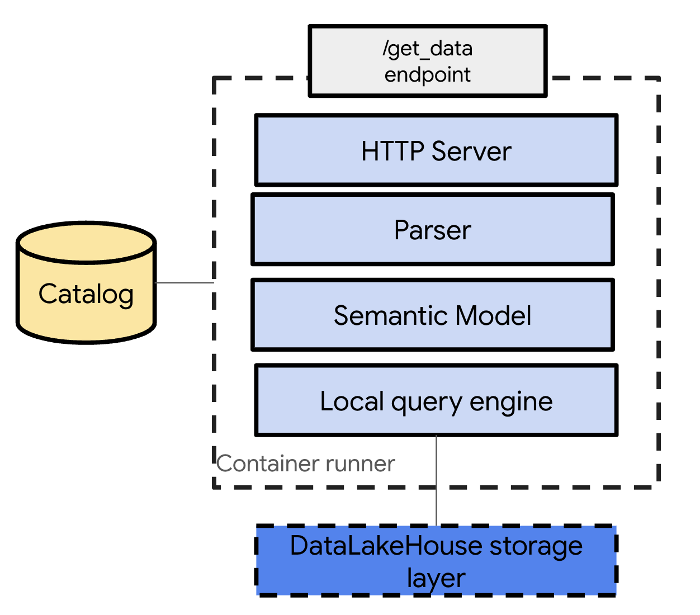

How It Works
============

dataPi is designed to simplify the process of creating and managing data pods for distributed datalakehouse systems. Here's an overview of how dataPi works:

Core Concepts
-------------

1. **dataPods**: Container-based deployable units that contain a local engine to resolve queries, specified as resources in a YAML file.

3. **Iceberg DataLakehouse**: Cloud storage based DataLake with Iceberg files.

4. **Metastore Integration**: dataPods interact with a metastore to locate and access data.

Workflow
--------

1. **Query Specification**:
   Developers define their query requirements (e.g., sales aggregated by quarter where region is EMEA) in a YAML file.

2. **dataPod Creation**:
   When ``datapi run`` is executed, it creates a dataPod based on the YAML specification.

3. **API Exposure**:
   Each dataPod exposes an API REST endpoint.

4. **Query Execution**:
   When the API is called, the dataPod:
   
   a. Asks the metastore for the data location
   b. Checks if permissions are in place
   c. Retrieves the data
   d. Executes the query locally within the container
   e. Sends the data back to the application

This approach allows for efficient query resolution without calling the central DataPlatform engine.

Supported Technologies
----------------------

dataPi is built to work with various data platform technologies:

- **Lakehouse data format**: Apache Iceberg
- **Cloud Storage**: GCS, AWS S3, and Microsoft ADLS
- **Metastore**: Apache Polaris
- **dataPod deployment target**: Google Cloud Run
- **dataPod build service**: Google Cloud Build

Query Sources
-------------

Currently, dataPi supports Iceberg tables as query sources.

dataPod Types
-------------

dataPi supports two types of dataPods:

1. **Projection dataPods**:
   - Support the ``select`` and ``filters`` query operators.

2. **Reduction dataPods**:
   - Support the ``aggregate``, ``group_by``, and ``filters`` query operators.

Next Steps
----------

To learn how to set up and use dataPi in your project, proceed to the :doc:`getting_started` guide.
